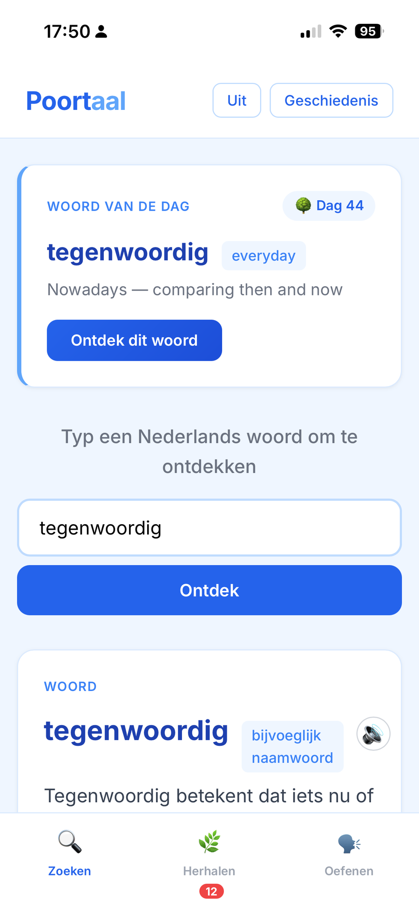
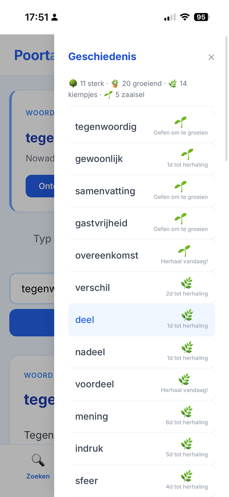
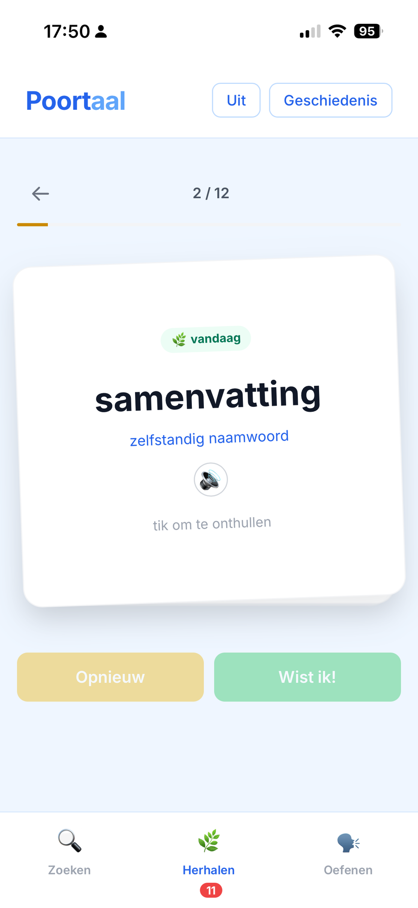
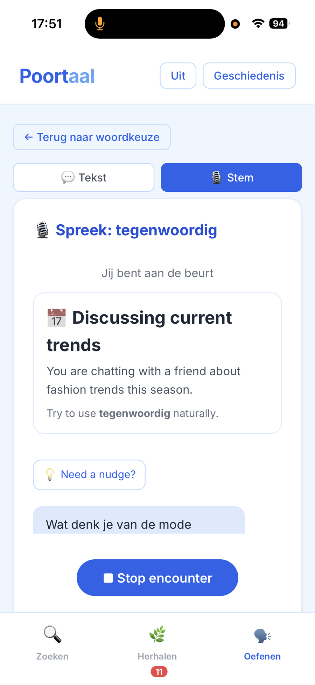

# Poortaal

**Learn Dutch words in context — then practise using them in real conversations.**

Poortaal is a Dutch vocabulary learning app built around a simple idea: looking up a word is only the beginning. It combines AI-generated explanations, active recall, spaced repetition, and contextual practice to help new vocabulary stick.

### [Try Poortaal →](https://lanfeitiao.github.io/poortaal/)

## What you can do

- **Explore a Dutch word** — get its meaning, grammar, usage, examples, and memory-friendly context.
- **Build a daily habit** — discover a curated *Woord van de Dag* and keep a learning streak.
- **Review at the right time** — spaced repetition brings words back when they are due.
- **See vocabulary grow** — a plant-inspired progression turns repeated exposure and practice into visible progress.
- **Practise in context** — use a target word in short AI-generated real-life role-play scenarios.
- **Speak it out loud** — experimental realtime voice encounters create a lightweight Dutch conversation around the word.
- **Keep progress across devices** — optional sign-in syncs vocabulary and learning history.

## A look at Poortaal

  
  
  
  

Explore · Grow · Review · Practise

## How it works

Poortaal treats vocabulary learning as a small loop rather than a one-off lookup:

**Discover → Understand → Remember → Practise → Review**

AI is used where context matters: generating structured word explanations and creating practice situations around the learner's target word. Learning state is tracked separately so review timing and progress remain predictable.

The realtime tutor is an experimental part of the project. It uses short generated encounters and progressive scaffolding so the learner gets support when needed without immediately being given the answer.

## Built with

**TypeScript · Vite · OpenAI · OpenAI Realtime · Cloudflare Workers · Supabase**

The frontend is deployed publicly with GitHub Pages. A Cloudflare Worker keeps model credentials server-side and provides the AI and realtime session endpoints. Supabase powers optional authentication and cloud sync.

## Project status

Poortaal is an actively developed personal project and a playground for exploring how AI can make language learning more contextual, active, and enjoyable.

The core word-learning and review experience is usable today. Realtime voice practice is still experimental and is being iterated on, especially around natural turn-taking, speech recognition, and learner scaffolding.
