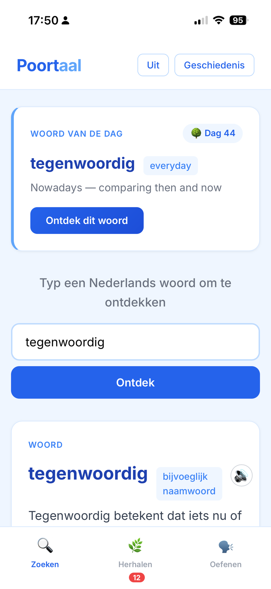
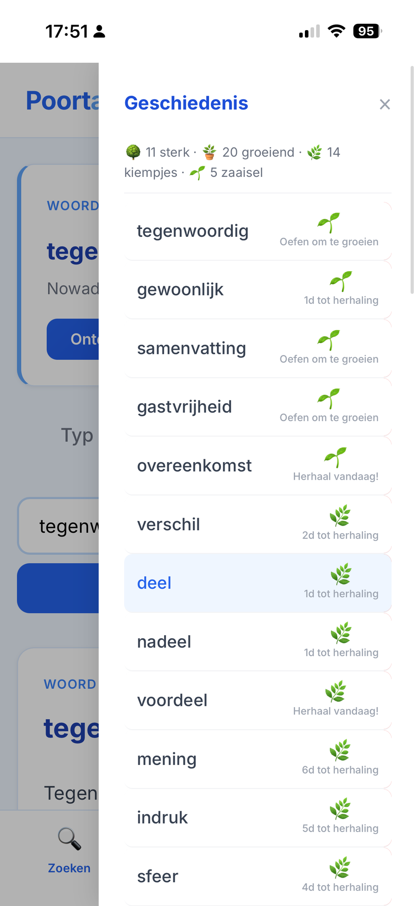
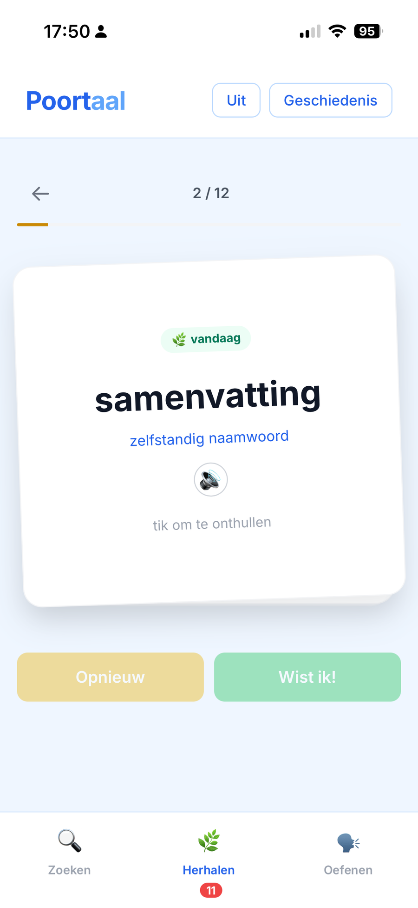
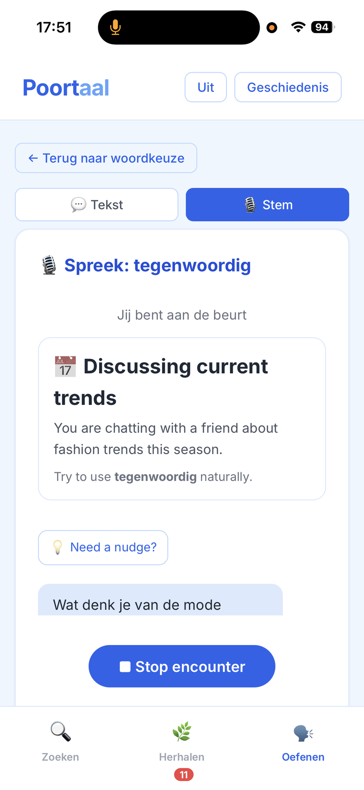

# Poortaal

**Learn Dutch words in context — then practise using them in real conversations.**

Poortaal is a Dutch vocabulary learning app built around a simple idea: looking up a word is only the beginning. It combines AI-generated explanations, active recall, spaced repetition, and contextual practice to help new vocabulary stick.

### [Try Poortaal →](https://lanfeitiao.github.io/poortaal/)

## What you can do

- **Explore a Dutch word** — get its meaning, grammar, usage, examples, and memory-friendly context.
- **Build a daily habit** — discover a curated *Woord van de Dag* and keep a learning streak.
- **Review at the right time** — spaced repetition brings words back when they are due.
- **See vocabulary grow** — a plant-inspired progression turns repeated exposure and practice into visible progress.
- **Practise in context** — use a target word in short AI-generated real-life role-play scenarios.
- **Speak it out loud** — experimental realtime voice encounters create a lightweight Dutch conversation around the word.
- **Keep progress across devices** — optional sign-in syncs vocabulary and learning history.

## A look at Poortaal

<table>
  <tr>
    <td align="center"><strong>Explore</strong></td>
    <td align="center"><strong>Grow</strong></td>
    <td align="center"><strong>Review</strong></td>
    <td align="center"><strong>Practise</strong></td>
  </tr>
  <tr>
    <td></td>
    <td></td>
    <td></td>
    <td></td>
  </tr>
</table>

## How it works

Poortaal treats vocabulary learning as a small loop rather than a one-off lookup:

**Discover → Understand → Remember → Practise → Review**

AI is used where context matters: generating structured word explanations and creating practice situations around the learner's target word. Learning state is tracked separately so review timing and progress remain predictable.

The realtime tutor is an experimental part of the project. It uses short generated encounters and progressive scaffolding so the learner gets support when needed without immediately being given the answer.

Each word can also carry up to two common collocations or sentence frames. Older saved words are enriched when opened, keeping their original definition and examples. Review varies the task inside the same word card: meaning, collocation recall, or a short contextual response. Practice selects a use that needs attention and creates another everyday situation around it.

After text or voice practice, a short reflection quotes the learner's own words, offers at most one correction, and invites a one-sentence retry. Optional naturalness suggestions are distinguished from errors. Learners can dismiss incorrect feedback. Hints and retries count as supported use; self-graded review does not count as independent conversation output. These observations stay attached to the word and inform later review and practice.

Learning observations are saved locally per account and synced through the existing `user_words.word_data` JSON field; no database migration is needed. Voice finishing mutes input and briefly drains late captions before analysis. Unsettled or failed transcripts do not produce a learning assessment, and text analysis does not assess pronunciation.

## Checking the learning loop

Run `npm test`, `npm run eval:words` (offline fixture validation), and `npm run build` for the automated checks. To check the interaction locally with `npm run dev`:

1. Look up **afspraak** and open its attached application, then start practice from the word.
2. Try “Ik wil een afspraak doen” in text practice, finish, and inspect the quoted correction. Try again with **maken**; the retry should count as supported use.
3. Dismiss feedback and check that its observation no longer appears in the next practice instructions. Review the same word: reveal before grading; a successful self-grade should not become an independent attempt.
4. In voice practice, stop while a last caption is arriving. Check that input is muted, the final caption is included, and the microphone is released. Also leave during generation/analysis and switch accounts: no stale feedback should be saved to the next session or account.
5. Open a word card or a full/quick review before initial cloud sync finishes, then let a newer cloud dismissal arrive. The card should refresh, old review prompts should close without adding a grade, and review home should reflect the merged records. Syncing unchanged observations should preserve an active review.
6. Let an older word's pending usage enrichment finish after cloud sync. New cloud definitions, examples, and existing usages should remain intact; generated usages should only fill a missing usage list.

## Built with

**TypeScript · Vite · OpenAI · OpenAI Realtime · Cloudflare Workers · Supabase**

The frontend is deployed publicly with GitHub Pages. A Cloudflare Worker keeps model credentials server-side and provides the AI and realtime session endpoints. Supabase powers optional authentication and cloud sync.

## Project status

Poortaal is an actively developed personal project and a playground for exploring how AI can make language learning more contextual, active, and enjoyable.

The core word-learning and review experience is usable today. Realtime voice practice is still experimental and is being iterated on, especially around natural turn-taking, speech recognition, and learner scaffolding.
